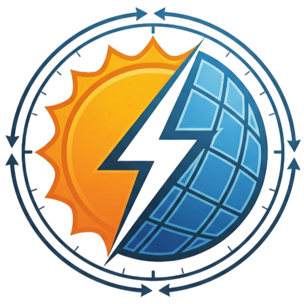

# ☀️ RAYMAX — Smart Solar Tracking & Telemetry System

> **Real-time solar panel tracking platform utilizing dual-servo alignment, LDR sensors, geolocation-aware astronomical sun tracking (NOAA model), live meteorological telemetry, and a state-of-the-art glassmorphic React dashboard.**

---

<div align="center">
  
  <br /><br />
  
  [](#)
  [](#)
  [](#)
  [](#)
  [](#)
</div>

---

## 📖 Overview

**RAYMAX** is a full-stack, hardware-integrated solar tracking and observability ecosystem. It combines an advanced **ESP32 dual-axis physical tracker** with a premium, real-time **React Web Dashboard**. 

The system operates in two tracking modes:
1. **LDR Sensor Mode (Standard)**: Follows the brightest light source in real time using 4 quadrant photoresistors.
2. **Astronomical API Mode (Fallback)**: When LDR light differences are insufficient (e.g., cloudy skies or night), the dashboard calculates the exact elevation/azimuth using the **NOAA Solar Position Model** combined with the user's GPS location and aligns the panel to maximize efficiency.

---

## ✨ Features at a Glance

### 🖥️ Dashboard & Web Experience
* **Glassmorphic Design**: Sleek dark/light modes powered by CSS organic blob animations, premium typography, and micro-animations.
* **Interactive 3D Panel**: A CSS 3D solar panel mockup that physically rotates and pivots in real time to match the exact angles of the hardware servos.
* **Dual-Method Authentication**: Fully secure login portal supporting standard **Email/Password** as well as custom **Mobile/Password** login with session validations stored in Cloud Firestore.
* **Sun Compass & Sky Map**: Visualizes the sun's current position and estimated daytime path on a dynamic SVG compass.
* **60-Read historical Graphs**: Live charts powered by `Chart.js` tracking Power Output (W), Voltage (V), and Temperature (°C) with dynamic scaling.
* **Telemetric Serial Monitor**: Real-time websocket logs showing incoming JSON data frames direct from the ESP32.

### 🔌 Hardware Integration & Safety
* **Motor Protection Constrains**: Hard-coded safety limits on servo movements (**Servo X: 0–140°** and **Servo Y: 12–180°**) to prevent motor strain, overheating, and mechanical collision.
* **Bidirectional Sync**: Instantly override auto-tracking to switch to **Manual Slider Control** from the web dashboard.
* **Credentials Sanitization**: Configured with local `config.js` integration (ignored in git) to prevent committing private Firebase database keys and GitHub tokens to public repositories.

---

## 📁 Project Architecture

```
RAYMAX/
│
├── index.html           # Main dashboard web app shell (React 18, Chart.js, Firebase)
├── App.jsx              # Core React components (Charts, 3D Canvas, Control Panels, Toasts)
├── script.js            # NOAA algorithms, API fetchers, and WebSocket manager
├── style.css            # Custom Design System (Glassmorphic filters, responsive grids)
├── logo.png             # Official RAYMAX branding asset
│
├── config.js            # [PRIVATE] Active Firebase credentials (git-ignored)
├── config.example.js    # Public template file for Firebase setup
│
├── auth/                # Dual Authentication Portal
│   ├── index.html       # Auth Gateway shell
│   ├── auth.jsx         # Custom mobile-auth routing and Firestore verification
│   └── auth.css         # Glass layout styles for Auth Views
│
└── README.md            # Technical documentation & user setup guide (this file)
```

---

## ⚙️ Hardware Setup & ESP32 Firmware

### 🗺️ Pin Mappings (ESP32)

| Component | ESP32 Pin | Description |
|---|---|---|
| **LDR Top** | GPIO 34 | Analog Light Sensor — Top |
| **LDR Bottom** | GPIO 35 | Analog Light Sensor — Bottom |
| **LDR Left** | GPIO 32 | Analog Light Sensor — Left |
| **LDR Right** | GPIO 33 | Analog Light Sensor — Right |
| **Solar Voltage** | GPIO 36 | Analog Voltage Divider reading |
| **Servo X (Tilt)** | GPIO 18 | Servo Motor for Vertical Elevation |
| **Servo Y (Azimuth)**| GPIO 19 | Servo Motor for Horizontal Rotation |

### 🛠️ ESP32 Firmware Code

Copy and upload the following code to your ESP32 using the Arduino IDE. Make sure to install `ArduinoJson`, `ESP32Servo`, and `WebSockets` libraries.

```cpp
#include <WiFi.h>
#include <WebSocketsServer.h>
#include <ArduinoJson.h>
#include <ESP32Servo.h>
#include <HTTPClient.h>

// ================== PIN DEFINITIONS ==================
#define LDR_TOP     34
#define LDR_BOTTOM  35
#define LDR_LEFT    32
#define LDR_RIGHT   33
#define SOLAR_PIN   36
#define SERVO_X     18
#define SERVO_Y     19

// ================== OBJECTS ==================
Servo servoX;
Servo servoY;
WebSocketsServer webSocket = WebSocketsServer(81);

int angleX = 90;
int angleY = 90;
bool autoMode = true; // Starts in Auto Track mode automatically

// Replace with your Network Credentials
const char* ssid = "Gourav's Galaxy A31";
const char* password = "12345678";

unsigned long lastRead = 0;
unsigned long lastPrint = 0;

// ===== SUN TRACKING VARS =====
float latitude = 0;
float longitude = 0;
float azimuth = 0;
float elevation = 0;
bool locationFetched = false;

String trackingMode = "LDR";

// LDR variables for telemetry
int topVal = 0;
int bottomVal = 0;
int leftVal = 0;
int rightVal = 0;

// ================== FUNCTIONS ==================

int readLDR(int pin) {
  long sum = 0;
  for (int i = 0; i < 8; i++) {
    sum += analogRead(pin);
    delayMicroseconds(100);
  }
  return sum / 8;
}

float readSolarVoltage() {
  long sum = 0;
  for (int i = 0; i < 10; i++) {
    sum += analogRead(SOLAR_PIN);
    delayMicroseconds(100);
  }
  float avgRaw = sum / 10.0;
  float vPin = (avgRaw * 3.3) / 4095.0;
  return vPin * (14.7 / 4.7); // Voltage divider ratio (R1=10k, R2=4.7k)
}

void getLocation() {
  HTTPClient http;
  http.begin("http://ip-api.com/json");

  if (http.GET() == 200) {
    StaticJsonDocument<500> doc;
    deserializeJson(doc, http.getString());

    latitude = doc["lat"];
    longitude = doc["lon"];
    locationFetched = true;
    Serial.println("📍 Geolocation fetched successfully!");
  } else {
    Serial.println("⚠️ Geolocation API failed");
  }
  http.end();
}

void getSunPosition() {
  if (!locationFetched) return;
  // Dashboard handles astronomical calculations and overrides servo positions if necessary
}

void moveFromSun() {
  // Translate celestial coordinates to servo angles inside hardware safety range
  int targetX = constrain(elevation * 2, 0, 140);
  int targetY = constrain(azimuth / 2, 12, 180);
  
  angleX = targetX;
  angleY = targetY;
  servoX.write(angleX);
  servoY.write(angleY);
}

// ===== WEBSOCKET RECEIVER =====
void webSocketEvent(uint8_t num, WStype_t type, uint8_t * payload, size_t length) {
  if (type == WStype_TEXT) {
    StaticJsonDocument<256> doc;
    DeserializationError error = deserializeJson(doc, payload);
    if (error) return;
    
    String cmd = doc["cmd"];
    if (cmd == "auto") {
      autoMode = true;
      Serial.println("⚡ Auto Mode enabled via WebSocket");
    } else if (cmd == "move") {
      autoMode = false;
      int t = doc["tilt"];
      int a = doc["azimuth"];
      
      // Restrict sliders movements to hardware safety boundaries
      angleX = constrain(t, 0, 140);
      angleY = constrain(a, 12, 180);
      
      servoX.write(angleX);
      servoY.write(angleY);
      Serial.printf("🎛 Manual move via WebSocket: X=%d, Y=%d\n", angleX, angleY);
    }
  }
}

void setup() {
  Serial.begin(115200);
  
  servoX.attach(SERVO_X);
  servoY.attach(SERVO_Y);
  
  // Safe bounds lock
  angleX = constrain(angleX, 0, 140);
  angleY = constrain(angleY, 12, 180);
  servoX.write(angleX);
  servoY.write(angleY);

  WiFi.begin(ssid, password);
  Serial.print("Connecting to WiFi");
  while (WiFi.status() != WL_CONNECTED) {
    delay(500);
    Serial.print(".");
  }
  Serial.println("\nWiFi Connected!");
  Serial.print("IP Address: ");
  Serial.println(WiFi.localIP());

  webSocket.begin();
  webSocket.onEvent(webSocketEvent);

  getLocation();
  Serial.println("🚀 SYSTEM READY");
}

void loop() {
  webSocket.loop();
  unsigned long currentMillis = millis();

  // ===== AUTO TRACKING CYCLE =====
  if (autoMode && (currentMillis - lastRead >= 5000)) {
    long sumTop = 0, sumBottom = 0, sumLeft = 0, sumRight = 0;
    const int numSamples = 10;
    
    for (int i = 0; i < numSamples; i++) {
      sumTop += readLDR(LDR_TOP);
      sumBottom += readLDR(LDR_BOTTOM);
      sumLeft += readLDR(LDR_LEFT);
      sumRight += readLDR(LDR_RIGHT);
      delay(5); // Non-blocking minimal delay
    }

    topVal = sumTop / numSamples;
    bottomVal = sumBottom / numSamples;
    leftVal = sumLeft / numSamples;
    rightVal = sumRight / numSamples;

    bool ldrFail = false;
    if (abs(topVal - bottomVal) < 50 && abs(leftVal - rightVal) < 50) {
      ldrFail = true;
    }

    if (!ldrFail) {
      // ===== LDR ALIGNMENT =====
      int threshold = 80;
      int step = 2; // Smooth tracking increments

      if (topVal - bottomVal > threshold)
        angleX = constrain(angleX - step, 0, 140);
      else if (bottomVal - topVal > threshold)
        angleX = constrain(angleX + step, 0, 140);

      if (leftVal - rightVal > threshold)
        angleY = constrain(angleY - step, 12, 180);
      else if (rightVal - leftVal > threshold)
        angleY = constrain(angleY + step, 12, 180);

      servoX.write(angleX);
      servoY.write(angleY);

      trackingMode = "LDR";
    } else {
      // ===== SUN API ALIGNMENT =====
      if (locationFetched) {
        getSunPosition();
        moveFromSun();
        trackingMode = "SUN";
      }
    }
    lastRead = currentMillis;
  }

  // ===== TELEMETRY TRANSMISSION (1 Hz) =====
  if (currentMillis - lastPrint >= 1000) {
    float volt = readSolarVoltage();
    float temp = 28.5 + random(-10, 10) / 10.0; // Simulated board temp

    // Send telemetry to WebSocket dashboard clients
    StaticJsonDocument<256> telemetryDoc;
    telemetryDoc["ldr_top"] = topVal;
    telemetryDoc["ldr_bottom"] = bottomVal;
    telemetryDoc["ldr_left"] = leftVal;
    telemetryDoc["ldr_right"] = rightVal;
    telemetryDoc["solar_voltage"] = volt;
    telemetryDoc["temperature"] = temp;
    telemetryDoc["tilt"] = angleX;
    telemetryDoc["azimuth"] = angleY;
    telemetryDoc["tracking_mode"] = trackingMode;

    String payload;
    serializeJson(telemetryDoc, payload);
    webSocket.broadcastTXT(payload);

    // Formatted print matching web serial console
    Serial.printf("Mode:%s | Tracking:%s | X:%d Y:%d | Top:%d Bot:%d L:%d R:%d | Volt: %.2f | Temp: %.1f\n",
                  autoMode ? "AUTO" : "MANUAL",
                  trackingMode.c_str(),
                  angleX, angleY,
                  topVal, bottomVal, leftVal, rightVal,
                  volt, temp);

    lastPrint = currentMillis;
  }
}
```

---

## 🌐 Software Setup

### 1. Firebase Project Configuration
Create a project on the [Firebase Console](https://console.firebase.google.com/) and copy the web configuration parameters.
1. Duplicate `config.example.js` and rename it to `config.js`.
2. Open `config.js` and insert your Firebase configuration details:
```javascript
window.firebaseConfig = {
  apiKey: "YOUR_API_KEY",
  authDomain: "YOUR_PROJECT_ID.firebaseapp.com",
  databaseURL: "https://YOUR_PROJECT_ID-default-rtdb.firebaseio.com",
  projectId: "YOUR_PROJECT_ID",
  storageBucket: "YOUR_PROJECT_ID.appspot.com",
  messagingSenderId: "YOUR_MESSAGING_SENDER_ID",
  appId: "YOUR_APP_ID"
};
```
3. Set up **Authentication** in Firebase using your preferred sign-in provider (e.g. Email/Password).
4. Create a **Cloud Firestore** database.

### 2. Launch Local Server
Serve the project directory to prevent CORS issues with reverse geocoding and local geolocation APIs.
```bash
# Using NodeJS
npx serve .

# Alternatively, using Python
python -m http.server 8080
```
Open **[http://localhost:3000](http://localhost:3000)** (or port 8080) to access the dashboard.

---

## 🎨 UI Design System

* **Typography**: Outfit/Inter typography hierarchy loaded from Google Fonts.
* **Glass Physics**: Cards styled with `backdrop-filter: blur(28px) saturate(180%)` combined with layered subtle shadow matrices.
* **Interactive 3D Solar Panel Engine**: Raw HTML elements pivoted dynamically using pure CSS 3D transforms (`transform-style: preserve-3d`) to replicate the exact physical movements of the tracking hardware.
* **Data Sources**: Badges automatically detect active WebSocket connectivity. In offline states, simulated feeds and graph curves maintain full dashboard animation and functionality.

---

## 📄 License

This project is licensed under the MIT License - see the LICENSE file for details.
